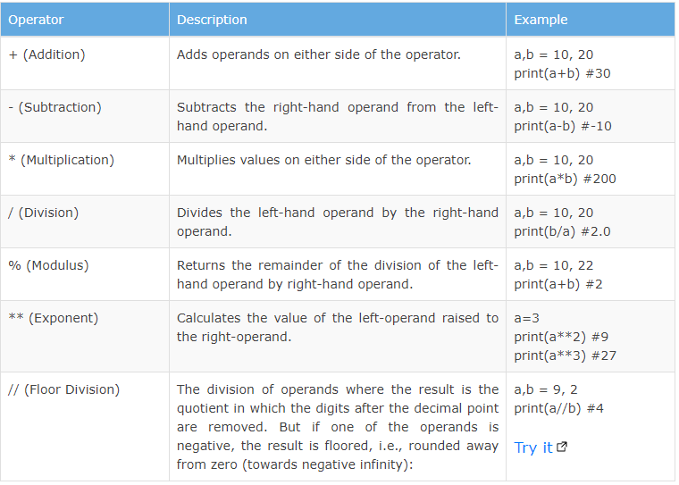

[[_TOC_]]
# Wstęp do programowania
## Algorytm
## Paradygmaty programowania
* programowanie imperatywne
* programowanie delkaratywne
* programowanie funkcyjne
* programowanie obiektowe
## Języki programowania
* C/C++
* Java
* javascript
* Python
* PHP
* Rust
* Go
* MATLAB
* HTML
* CSS
* LaTeX
* markdown
* SQL
# Python
## RELP (hello world)
```shell
$ python3.10
Python 3.10.6 (main, Nov 14 2022, 16:10:14) [GCC 11.3.0] on linux
Type "help", "copyright", "credits" or "license" for more information.
>>> print("Hello world")
Hello world
```
## Typy danych
### int
    Hello world
    Liczby całkowite 

In Python, integers are zero, positive or negative whole numbers without a fractional part and having unlimited precision, e.g. 0, 100, -10. The followings are valid integer literals in Python.

    #integer variables
    x = 0
    print(x)
    
    x = 100
    print(x)
    
    x = -10
    print(x)
    
    x = 1234567890
    print(x)
    
    x = 5000000000000000000000000000000000000000000000000000000
    print(x)

Integers can be binary, octal, and hexadecimal values.

    b = 0b11011000 # binary
    print(b)
    
    o = 0o12 # octal
    print(o)
    
    h = 0x12 # hexadecimal
    print(h)

All integer literals or variables are objects of the int class. Use the type() method to get the class name, as shown below

    print(type(100))
    
    x=1234567890
    print(type(x))
    
    y=5000000000000000000000000000000000000000000000000000000
    print(type(y))

Note: Leading zeros in non-zero integers are not allowed in Python, e.g. 000123 is invalid number and 0000 becomes 0.

    x=001234567890 #syntaxError: invalid token
Python does not allow comma as number delimiter. Use underscore _ as a delimiter instead.

    x = 1_234_567_890
    print(x) #output: 1234567890

Note that integers must be without a fractional part (decimal point). It it includes a fractional then it becomes a float.

    x=5
    print(type(x)) #output: <class 'int'>
    
    x=5.0
    print(type(x)) #output: <class 'float'>

The int() function converts a string or float to int.

    x = int('100')
    print(x) #output: 100
    
    y = int('-10')
    print(y) #output: -10
    
    z = int(5.5)
    print(z) #output: 5
    
    n = int('100', 2)
    print(n) #output: 4


#### operatory matematyczne (+, -, /, //, *, %)

### Binary

A number having 0b with eight digits in the combination of 0 and 1 represent the binary numbers in Python. For example, 0b11011000 is a binary number equivalent to integer 216.

    x = 0b11011000
    print(x)
    
    x = 0b_1101_1000
    print(x)
    print(type(x))

### Octal

A number having 0o or 0O as prefix represents an octal number. For example, 0O12 is equivalent to integer 10.

    x = 0o12
    
    print(x)
    print(type(x))

### Hexadecimal

A number with 0x or 0X as prefix represents hexadecimal number. For example, 0x12 is equivalent to integer 18.

    x = 0x12
    
    print(x)
    print(type(x))


### float

Floating point numbers (float) are positive and negative real numbers with a fractional part denoted by the decimal symbol . or the scientific notation E or e, e.g. 1234.56, 3.142, -1.55, 0.23.

    f = 1.2
    print(f) #output: 1.2
    print(type(f)) #output: <class 'float'>
    
    f=123_42.222_013 #output: 12342.222013
    print(f)
    
    f=2e400
    print(f) #output: inf

As you can see, a floating point number can be separated by the underscore _. The maximum size of a float is depend on your system. The float beyond its maximum size referred as inf, Inf, INFINITY, or infinity. For example, a float number 2e400 will be considered as infinity for most systems.

Scientific notation is used as a short representation to express floats having many digits. For example: 345.56789 is represented as 3.4556789e2 or 3.4556789E2

    f = 1e3
    print(f) #output: 1000.0
    
    f = 1e5
    print(f) #output:100000.0
    
    f = 3.4556789e2
    print(f) #output:
    print(type(f)) #output:345.56789

Use the float() function to convert string, int to float.

    f=float('5.5')
    print(f) #output: 5.5
    
    f=float('5')
    print(f) #output: 5.0
    
    f=float('     -5')
    print(f) #output: -5.0
    
    f=float('1e3')
    print(f) #output: 1000.0
    
    f=float('-Infinity')
    print(f) #output: -inf
    
    f=float('inf')
    print(f)  #output: inf
    print(type(f)) #output:<class 'float'>

### Complex Numbers

A complex number is a number with real and imaginary components. For example, 5 + 6j is a complex number where 5 is the real component and 6 multiplied by j is an imaginary component.

    a = 5+2j
    print(a)
    print(type(a))


### bool
### string
## Struktury danych
### list
### tuple
### set
### dict
### dostęp przez referrencje vs wartość
### generatory
#### yield
## Instrukcje sterujące przepływem (słowa kluczowe)
### if
#### not
#### and
#### or
### if-else
### if-elif
### if-elif-else
### for
#### in
#### break
#### continue
### while
### try-except
### with
#### otwieranie i czytanie plików, csv
### with-as
## list/dict comprahensions
## Funkcje
### def
### dekoratory
## Klasy
### class
### dziedziczenie
### atrybuty na różnych poziomach (klasa, instancja)
### metody
#### @classmethod
#### @property
## Biblioteki (korzystamy z tego co zostało napisane przez innych)
### biliotkea standardowa
#### import
#### itertools
#### functools
#### csv
#### datetime
#### os
### 3rd party
#### flask
#### FastAPI
#### numpy
# Narzędzia programistyczne
## makefile
## git
## .bashrc
## docker, docker-compose
## MailHog
## localhost
## ngrok
## venv
## pip i requirements.txt
# Bazy danych
## SQL
### PostgreSQL
#### SELECT
#### FROM
#### JOINs (LEFT, RIGHT, OUTER, INNER)
#### WHERE
#### Agregaty
##### SUM
##### AVG
#### GROUP BY
#### HAVING
#### CREATE TABLE
#### ALTER TABLE
#### DROP TABLE
#### TRUNCATE
## NoSQL
### MongoDB
### influxDB
# Django -- widoki renderowane przez backend
# Django -- rest
## Django Rest Framework
# Django -- GraphQL
## graphene
## strawberry